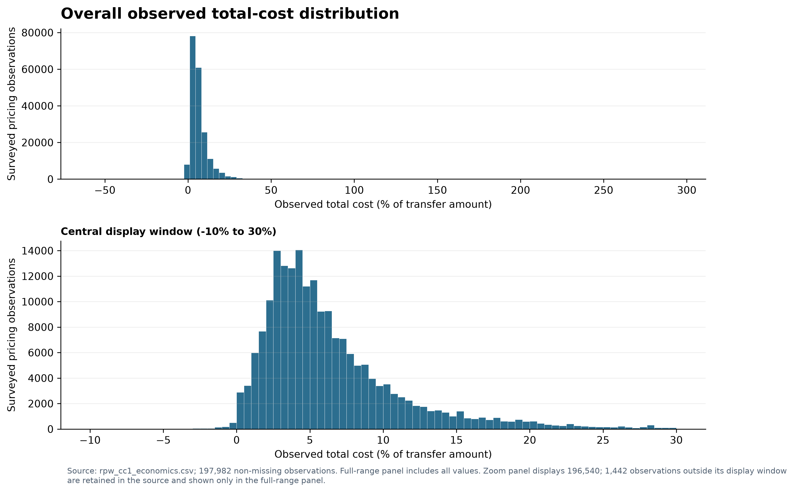
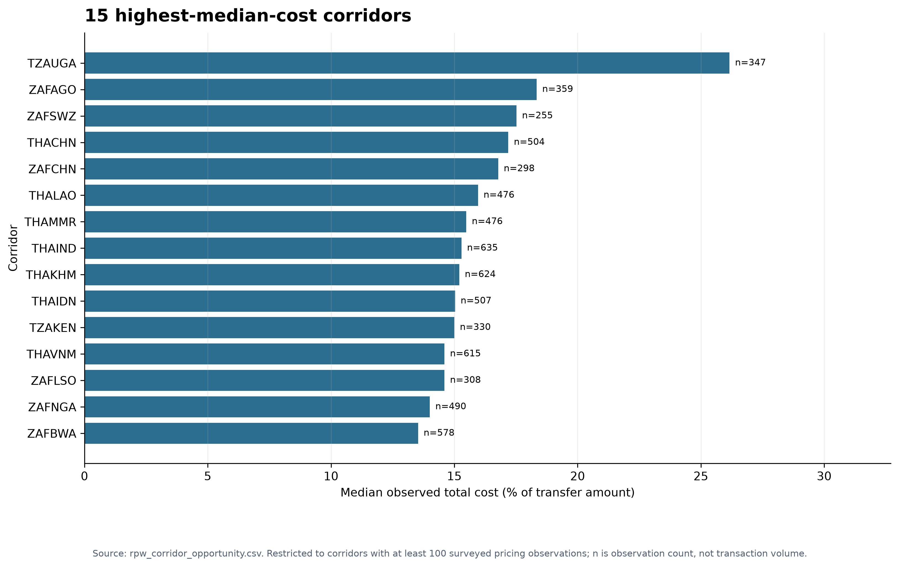
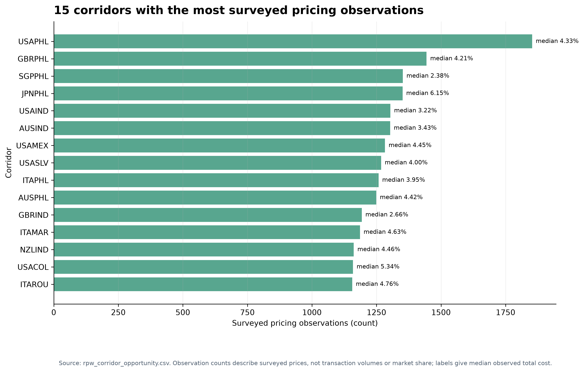
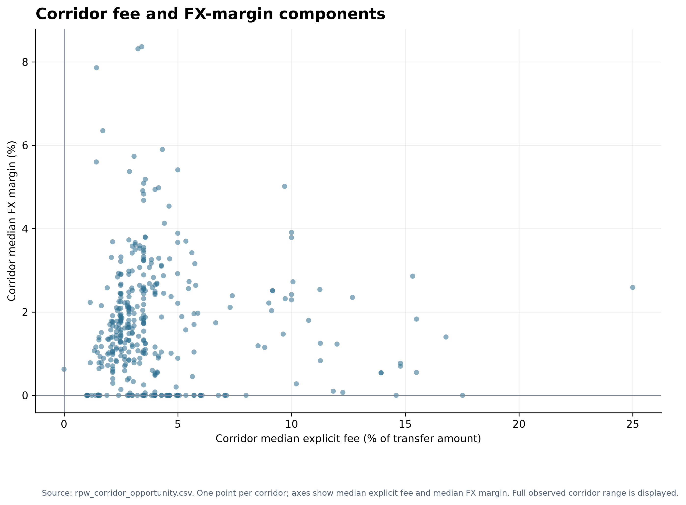
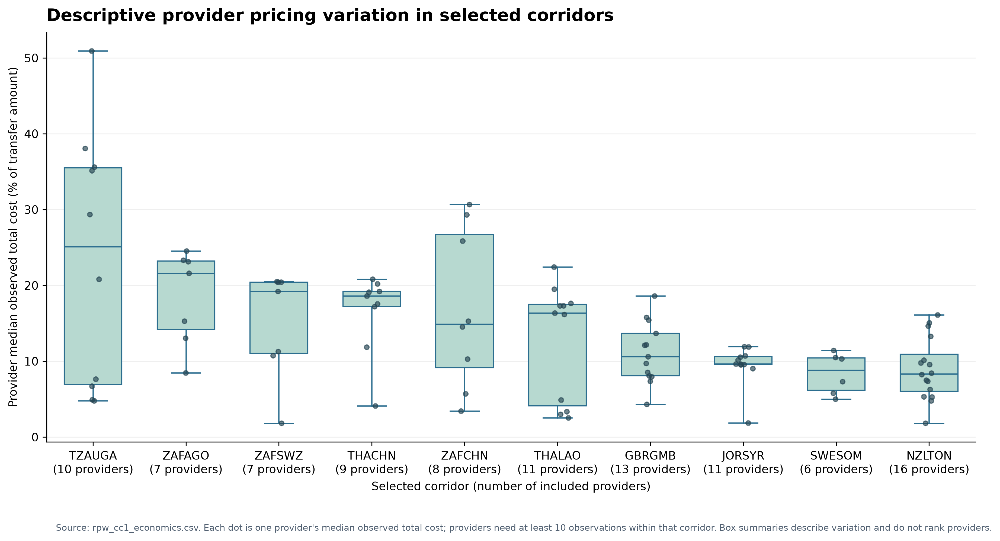
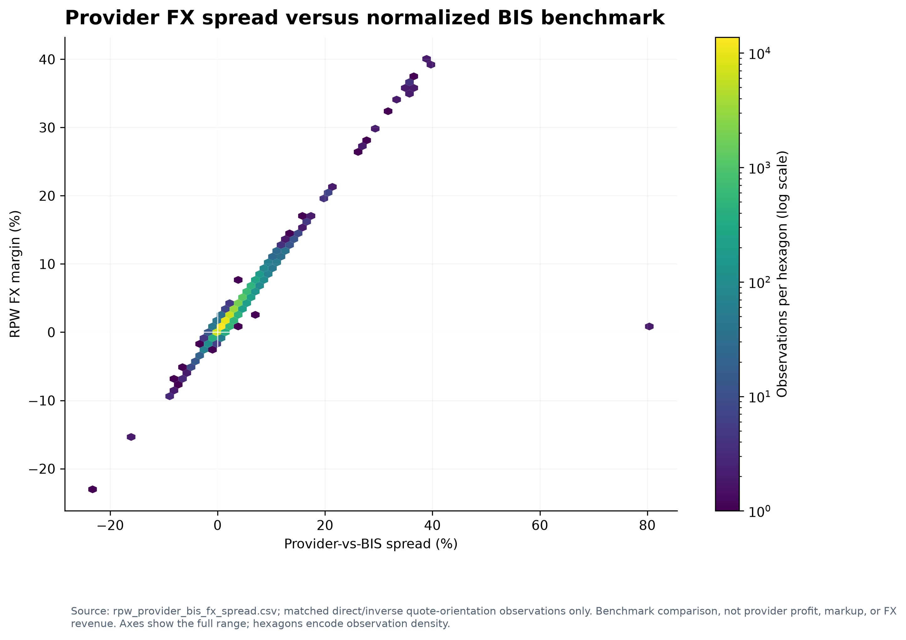
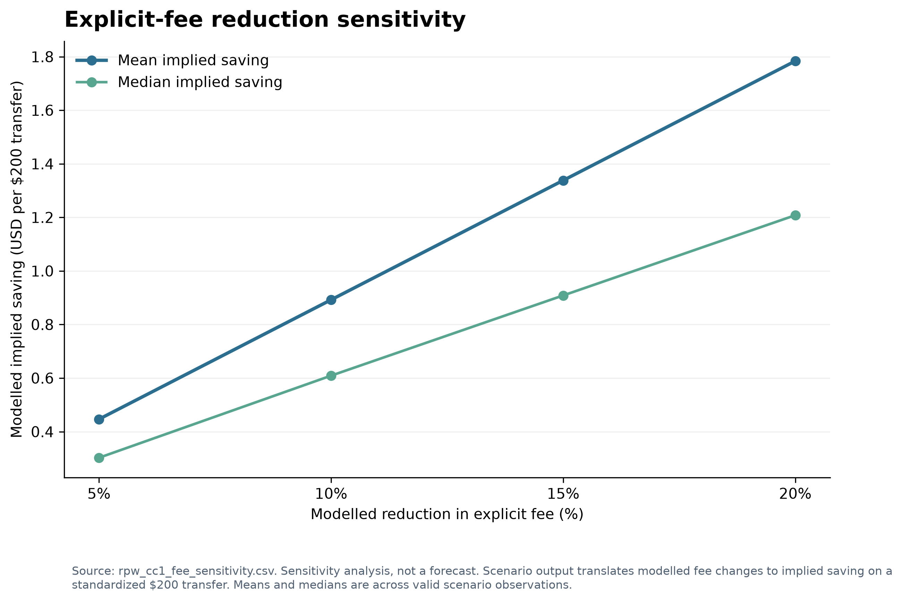
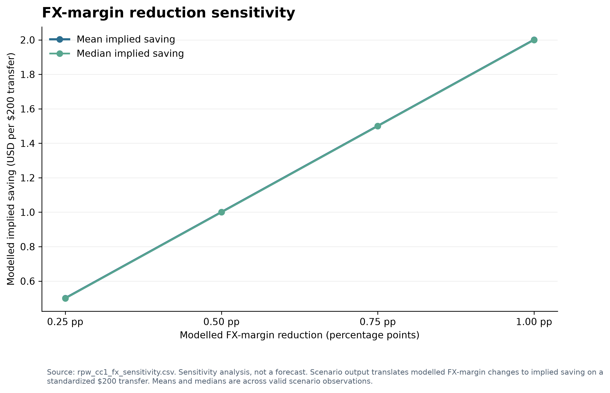

# Remittance Economics & FX Optimisation

## 1. Executive Summary

This project analyses **197,999 surveyed RPW pricing observations** spanning **372 corridors and 702 providers**. Every record in the prepared CC1 sample has a surveyed **$200 denomination**, providing a consistent transfer basis for comparing observed costs and illustrating modelled savings.

Observed RPW total cost is the authoritative customer-cost measure. In the full sample its mean is **6.58%** of the transfer amount (equivalent to **$13.16 per $200**) and its median is **5.07%** (**$10.14 per $200**). Among corridors with at least 100 observations, TURBGR has the highest mean observed cost (**30.45%**), although its median is lower (**13.10%**), showing why both measures matter.

Explicit fees account for most of reconstructed fee-plus-FX cost in several high-cost corridors, including TURBGR, TZAUGA and TZAKEN. FX margins dominate the component mix in corridors such as JORSYR and SWESOM. Fee and FX scenarios quantify arithmetic sensitivities on the standardized transfer; they are not forecasts or estimates of achievable savings.

The findings describe surveyed prices, not customer transactions, provider market share, or provider profitability. They can help focus further pricing review, but do not establish causes or current market prices.

## 2. Business Problem

Remittance customers face transfer costs that can include an explicit fee and a cost associated with the exchange rate. Comparing those components across routes can help identify where surveyed prices are high, where pricing differs across providers, and which cost component is more prominent in a corridor.

This project uses RPW survey data to describe those prices and compares eligible provider FX quotes with a normalized BIS exchange-rate benchmark. It also applies controlled fee and FX-margin changes to show how the modelled cost arithmetic responds. The data do not contain transaction flows, customer choices, provider operating costs, or realized savings, so the analysis does not estimate demand, profitability, or causal effects.

## 3. Data and Coverage

The primary source is the Remittance Prices Worldwide (RPW) dataset, prepared into a clean observation-level dataset and a CC1 economics dataset. The observed dates in the prepared sample run from **9 May 2016 to 14 March 2025**.

| Coverage item | Project sample |
|---|---:|
| Surveyed pricing observations | 197,999 |
| Corridors | 372 |
| Providers | 702 |
| CC1 denomination | $200 for all 197,999 observations |
| Observed date range | 9 May 2016–14 March 2025 |

These counts are **surveyed pricing observations**, not transaction volumes, customer demand, or market share. More observations in a corridor or for a provider mean more surveyed price records in this dataset only.

**CC1** is the RPW pricing observation for a standardized transfer denomination of **$200**. The dataset also contains a CC2 denomination, but the economics and scenario analysis in this project focus on CC1. The $200 amount is a comparison basis; the modelled dollar savings are arithmetic translations of percentage-point or fee changes for that standardized amount, not forecasts of savings on real transfers.

Primary processed datasets include `data/processed/rpw_cc1_economics.csv`, `data/processed/rpw_corridor_opportunity.csv`, `data/processed/rpw_bis_fx_benchmark_cc1.csv`, and `data/processed/rpw_provider_bis_fx_spread.csv`. Scenario outputs are in `data/processed/rpw_cc1_fee_sensitivity.csv` and `data/processed/rpw_cc1_fx_sensitivity.csv`.

## 4. Methodology

### Cost terminology

- **Observed total cost (`cc1_total_cost_pct`)** is the total-cost percentage reported in the RPW CC1 record. It is treated as authoritative throughout the analysis.
- **Explicit fee (`fee_pct`)** is the CC1 local-currency fee expressed as a percentage of the CC1 local-currency amount in the processed economics dataset.
- **FX margin (`cc1_fx_margin`)** is the FX-margin percentage reported in the RPW CC1 data.
- Fee plus FX margin is useful for describing components, but it does not replace reported RPW total cost. The two components do not reconstruct the authoritative total cost exactly for every record.

Corridor summaries report observed means and medians. Corridor comparisons requiring stronger sample coverage use the existing **100-observation** threshold where specified. Provider variation figures summarize each provider's median observed total cost within selected corridors and include providers with at least **10 observations in that corridor**.

### BIS FX benchmark

The benchmark combines exact-date BIS daily USD exchange-rate observations for the source and destination currencies to form a corridor cross-rate. Currency mapping and unambiguous daily-rate checks are applied. Provider FX quotes are normalized to a common quote orientation before comparison with the BIS rate. The full benchmark output retains all RPW rows and marks whether a benchmark is available; the normalized provider-spread dataset contains the eligible direct- or inverse-orientation matches.

The project defines **provider-vs-BIS FX spread** as the normalized BIS rate compared with the provider's quoted rate. Under this definition, a positive spread means the provider quote is below the normalized BIS benchmark. This is a rate comparison only: **provider-vs-BIS spread is not provider profit, markup, or FX revenue**.

### Observed analysis and modelled sensitivity

Observed results describe surveyed RPW prices and eligible benchmark comparisons. Sensitivity analysis mechanically changes either the explicit fee by 5%, 10%, 15%, or 20%, or the FX margin by 0.25, 0.50, 0.75, or 1.00 percentage points, holding the other component constant. Implied dollar savings are calculated on the standardized $200 transfer. These scenarios are **sensitivities, not forecasts**; they do not model provider responses, customer behaviour, implementation, or pass-through.

## 5. Observed Remittance Cost Analysis

Across observations with a reported total-cost value, mean observed total cost is **6.58%** and median is **5.07%**. On a $200 basis these correspond to **$13.16** and **$10.14**, respectively. The median is lower than the mean, and the observed distribution includes negative and extreme values; both features make it important to inspect the distribution rather than relying on a single average.

The figure shows all non-missing observed total-cost values in its full-range panel. Its central zoom is explicitly limited to −10% through 30%; observations outside that display window remain represented in the full-range panel and were not removed from the source.

## 6. Corridor and Provider Analysis

### Corridor costs and coverage

Among corridors with at least 100 surveyed observations, the highest mean observed costs include TURBGR (**30.45% mean; 13.10% median**), TZAUGA (**28.06%; 26.16%**), TZAKEN (**26.64%; 15.00%**), TZARWA (**21.22%; 13.37%**) and ZAFCHN (**19.25%; 16.78%**). TURBGR's mean is especially far above its median, consistent with a distribution affected by extreme observations.

The observation-count view provides sample context for the largest surveyed corridor samples. Counts are not customer transaction volumes or market share.

### Fee and FX components

The full-sample mean explicit fee is **4.46%** and mean FX margin is **2.12%**; their medians are **3.00%** and **1.47%**, respectively. Among the high-cost examples, the fee share of reconstructed component cost is **94.5% in TURBGR**, **85.3% in TZAUGA**, and **76.3% in TZAKEN**. The FX share is comparatively prominent in **JORSYR (80.5%)**, **SWESOM (73.7%)**, and **MYSMMR (72.3%)**. Component shares are calculated only from valid, nonnegative fee and FX observations and should not be read as a decomposition of every RPW total-cost observation.

### Descriptive provider pricing variation

The provider variation chart compares provider-level median observed total costs in the selected corridors. It includes a provider only when that provider has at least 10 observations in the corridor. The numbers below are the included provider counts, not transaction counts.

| Corridor | Providers included | Descriptive observation |
|---|---:|---|
| TZAUGA | 10 | Broad provider-median dispersion in the selected set. |
| ZAFAGO | 7 | Visible variation across provider medians. |
| ZAFSWZ | 7 | Visible variation across provider medians. |
| THACHN | 9 | Provider medians vary within the corridor. |
| ZAFCHN | 8 | Broad provider-median dispersion in the selected set. |
| THALAO | 11 | Provider medians span a visibly broad range. |
| GBRGMB | 13 | Variation is present across provider medians. |
| JORSYR | 11 | Provider medians are comparatively more concentrated than the widest selected distributions. |
| SWESOM | 6 | Provider medians are comparatively more concentrated than the widest selected distributions. |
| NZLTON | 16 | Variation is present across provider medians. |

These are descriptive within-corridor comparisons. They do not rank providers or explain why prices differ.

## 7. FX Benchmark Analysis

An exact-date BIS benchmark was available for **60,074 observations (30.3% of the full sample)** and **113 of 372 corridors**. Normalized provider-vs-BIS analysis uses the eligible quote-orientation matches and contains **48,097 observations**. Benchmark availability is incomplete and the benchmarked sample differs from the full sample: its mean observed total cost is **5.75%**, compared with **6.58%** in the full sample; its mean FX margin is **1.77%**, compared with **2.12%**. The benchmarked results should therefore not be generalized automatically to all RPW observations.

Among corridor summaries in the provider-spread analysis, ZAFCHN has a median provider-vs-BIS spread of **4.08%** across 171 eligible observations; CHEALB has a median of **4.94%** across 245. These figures are benchmark comparisons under the project's spread definition, not measures of profit, markup, or revenue.

The plotted sample is restricted to observations with direct or inverse quote-orientation matches. The chart uses hexagons to show observation density and retains the full axis range.

## 8. Pricing Sensitivity Analysis

The model applies one change at a time to existing fee and FX inputs, with the other component held constant. The standardized $200 basis translates the modelled cost difference into implied dollars. The outputs are mechanical sensitivities, not forecasts or claims that savings will occur.

In the existing 10% explicit-fee reduction scenario, mean implied saving is **$0.89 per $200** across valid observations (median **$0.61**). A 0.50 percentage-point FX-margin reduction implies mean saving of **$1.00 per $200** (median **$1.00**). Corridor-level fee sensitivity is largest in high-fee examples: under the 10% fee scenario, TURBGR implies **$5.84**, TZAUGA **$4.84**, and TZAKEN **$4.12** per $200 on average. The implied savings double under the corresponding 20% fee sensitivity because the model scales the fee reduction proportionally.

The FX reduction is a fixed percentage-point change, so its implied dollar effect is similar across corridors for valid observations. Fee-reduction savings vary with the observed fee level. Neither pattern establishes operational feasibility, customer pass-through, or a causal response.

## 9. Key Business Findings

1. **High observed costs are concentrated in a small set of corridors.** TURBGR, TZAUGA, and TZAKEN have the highest corridor means among corridors with at least 100 observations, though means and medians differ substantially in some corridors.
2. **Observed pricing varies materially within corridors.** The largest total-cost min-to-max ranges among screened corridors include TURBGR (294.53 percentage points), ZAFMWI (142.70), TZAUGA (101.64), and USANPL (101.09). These ranges include extreme observations and are not typical provider gaps.
3. **Explicit fees dominate reconstructed components in several high-cost corridors, while FX margins dominate in others.** This points to corridor-specific component mixes rather than a single explanation for all high costs.
4. **The BIS benchmark is informative but covers a subset.** It is available for 30.3% of observations, and the benchmark-available sample has lower mean cost and FX margin than the full sample.
5. **Sensitivity results are useful for screening, not prediction.** Fee reductions imply larger arithmetic effects where observed fees are high; fixed FX reductions produce similar per-transfer effects across valid observations.

## 10. Business Recommendations

- Review high-cost, sufficiently observed corridors such as TURBGR, TZAUGA, TZAKEN, and ZAFCHN using current, comparable quotes before deciding on interventions.
- Investigate unusual extremes and quote comparability in corridors with unusually wide observed ranges, while preserving the underlying source values.
- Tailor follow-up analysis to the observed fee/FX component mix: assess fee structures in fee-heavy corridors and FX rate setting where FX margins are a large component.
- Use the provider variation chart to identify corridors for further inquiry, not to label providers as best or worst.
- Treat scenario outputs as transparent sensitivity cases; assess implementation, provider response, customer behavior, and pass-through with additional evidence before using them as targets.
- Expand or refresh benchmark coverage before drawing broad conclusions from provider-vs-BIS comparisons.

## 11. Limitations

- **Historical survey data:** observations span May 2016 to March 2025 and do not establish current market pricing.
- **Survey coverage:** observation counts describe surveyed prices only, not customer demand, transfer volume, or market share. Provider and corridor coverage is uneven.
- **Outliers and negative values:** observed costs and component values include extreme and negative observations that can materially affect averages and ranges. They are retained and should be interpreted with robust summaries and distribution views.
- **Missing component data:** fee, FX, and benchmark fields are not complete for every observation. Component summaries use their stated valid-data subsets.
- **Reconstruction differences:** explicit fee plus FX margin does not reproduce the authoritative RPW observed total cost exactly for all records; reported total cost remains the primary cost measure.
- **Benchmark selection:** BIS rates require currency mapping, date availability, unambiguous rates, and quote-orientation matching. The benchmarked sample is smaller and differs from the full sample.
- **No behavioral elasticity or profit data:** the scenario model does not estimate customer switching, provider pricing responses, costs, revenue, profit, or the share of any saving passed through to customers.
- **No causal identification:** observed differences and modelled sensitivities describe associations and arithmetic implications, not causes or realized effects.

## 12. Technical Stack and Reproducibility

The project uses Python and pandas for preparation, descriptive analysis, benchmarking, and scenario outputs; SQL with DuckDB for profiling and queries; and Jupyter for exploratory analysis. Matplotlib produces the portfolio figures. Raw source data, processed datasets, scripts, SQL, notebooks, and report outputs are kept in separate project locations. The analysis is maintained in Git for versioned, reproducible work; scripts consume existing data products and preserve raw inputs.

### What this project demonstrates

- **Python:** repeatable data preparation, analysis, and visualization.
- **SQL/DuckDB:** structured profiling and corridor/provider queries.
- **Data quality:** checks for missingness, consistency, joins, coverage, and benchmark validity.
- **Exploratory analysis:** distributions, corridor summaries, and provider pricing variation.
- **FX benchmarking:** exact-date BIS rates, quote-orientation normalization, and provider-vs-BIS comparison.
- **Scenario modelling:** transparent fee and FX sensitivities on a standardized transfer basis.
- **Business analytics:** translating descriptive results into focused, evidence-led opportunities and caveats.
- **Reproducible Git/GitHub workflow:** version-controlled scripts and outputs that can be reviewed, rerun, and extended.
